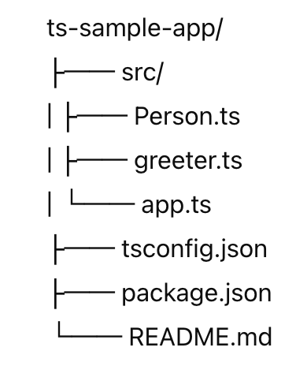

# TypeScript Sample Application

This is a simple TypeScript application that demonstrates basic functionality, including a class and a function. The application defines a `Person` class and prints a greeting message.

## Project Structure


## Files

### `src/Person.ts`

Defines the `Person` class with a constructor and a `greet` method.

### `src/greeter.ts`

Contains the `printGreeting` function that takes a `Person` instance and prints the greeting message to the console.

### `src/app.ts`

The main application logic that creates an instance of `Person` and calls the `printGreeting` function.

## Getting Started

### Prerequisites

- Node.js (version 14.x or higher)
- npm (version 6.x or higher)

### Folder structure



### Installation

1. Clone the repository:

```sh
git clone https://github.com/your-username/ts-sample-app.git
cd ts-sample-app

npm install
npx tsc
node dist/app.js
Hello, my name is Alice and I am 30 years old.
```

### License
This project is licensed under the MIT License - see the LICENSE file for details.

Acknowledgments

This `README.md` provides an overview of the project structure, installation instructions, and steps to build and run the application.
